# Mybatis

> Mybatis的mapper.xml配置文件——详解
>
> https://blog.csdn.net/qq_42780864/article/details/88055480


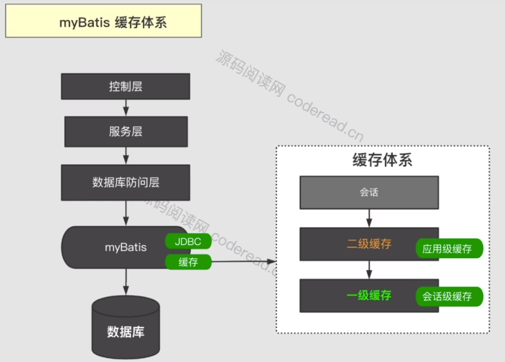


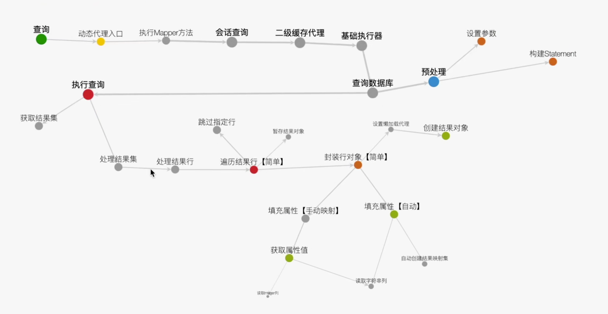

## 会话 SqlSession


## 执行器 Executor

处理一些共性

### 描述

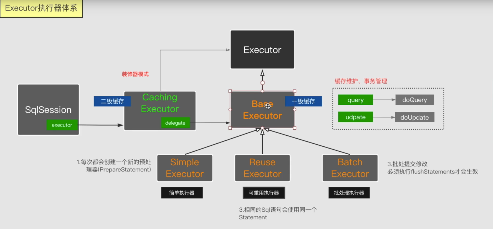

### 简单执行器

BaseExecutor

### 可重用执行器

ReuseExecutor

```markdown
相同sql只会编译一次，参数不一样也会重用
```


### 批处理执行器

BatchExecutor


## 缓存 Cache
### 一级缓存（会话级缓存）

#### 描述

​	PerpetualCache

​	与会话相关，sql，参数条件相关，提交修改都会清空

#### 命中条件


```markdown
1. sql与参数相同
2. 必须是相同的statementID(DAO方法是同一个)
3. sqlSession必须一样（会话级缓存）
4. RowBounds 分页行范围必须相同
```

```markdown
# 涉及清空缓存的都搞不了
1. 未手动清空
2. 未调用flushCache=true的查询
3. mapper执行update，commit，rollback方法也会清空缓存
4. localCacheScope未设置成STATEMENT(将一级缓存的作用域改为嵌套查询子查询等查询，普通查询不走一级缓存)
```

#### 源码解析

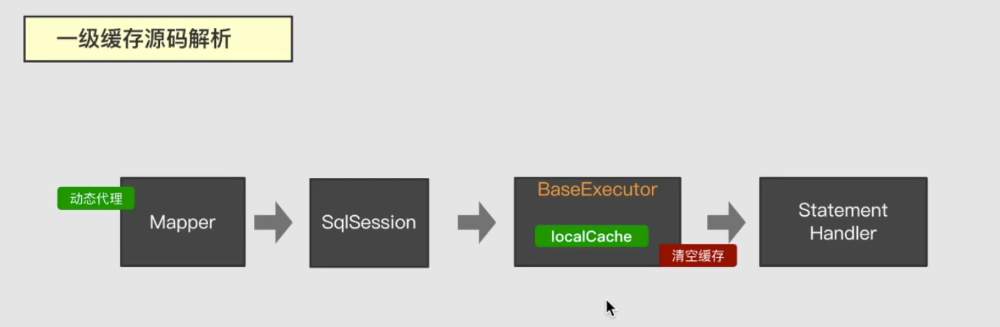

BaseExecutor

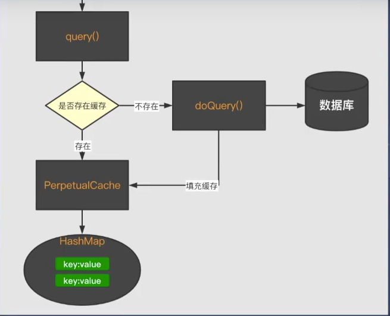  

第一次查询时

会将sql和传参生成一个缓存 CacheKey  并且设置在一级缓存中

```java
@Override
public <E> List<E> query(MappedStatement ms, Object parameter, RowBounds rowBounds, ResultHandler resultHandler) throws SQLException {
  BoundSql boundSql = ms.getBoundSql(parameter);
  //生成并设置缓存
  CacheKey key = createCacheKey(ms, parameter, rowBounds, boundSql);
  return query(ms, parameter, rowBounds, resultHandler, key, boundSql);
}
```

第二次查询时会再去查询缓存localCache

```java
@SuppressWarnings("unchecked")
@Override
public <E> List<E> query(MappedStatement ms, Object parameter, RowBounds rowBounds, ResultHandler resultHandler, CacheKey key, BoundSql boundSql) throws SQLException {
  ErrorContext.instance().resource(ms.getResource()).activity("executing a query").object(ms.getId());
  if (closed) {
    throw new ExecutorException("Executor was closed.");
  }
  if (queryStack == 0 && ms.isFlushCacheRequired()) {
    clearLocalCache();
  }
  List<E> list;
  try {
    queryStack++;
    // 查缓存
    list = resultHandler == null ? (List<E>) localCache.getObject(key) : null;
    if (list != null) {
      handleLocallyCachedOutputParameters(ms, key, parameter, boundSql);
    } else {
      list = queryFromDatabase(ms, parameter, rowBounds, resultHandler, key, boundSql);
    }
  } finally {
    queryStack--;
  }
  if (queryStack == 0) {
    for (DeferredLoad deferredLoad : deferredLoads) {
      deferredLoad.load();
    }
    // issue #601
    deferredLoads.clear();
    if (configuration.getLocalCacheScope() == LocalCacheScope.STATEMENT) {
      // issue #482
      clearLocalCache();
    }
  }
  return list;
}
```


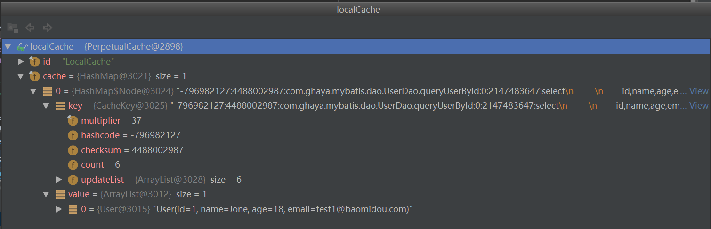

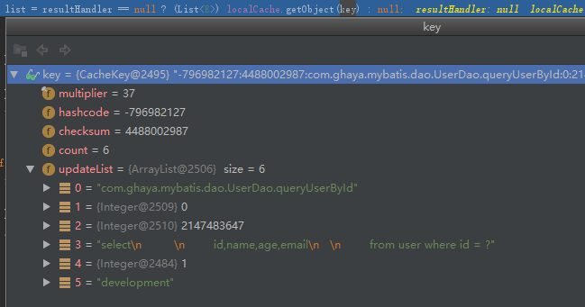

sqlsessiond不是线程安全的


##### 清空缓存方法

clearLocalCache()

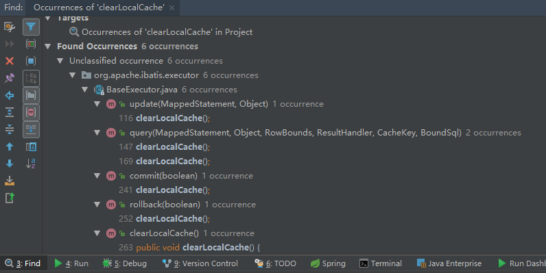

在嵌套子查询中不会清空一级缓存，因为子查询会依赖一级缓存


#### 失效问题

spring配置文件整合mybatis  每次查询都会发起一个新的会话

在执行器中断点发现，两次查询并不是同一个执行器。sqlsession和执行器是1:1的关系，所以他们也不是一个sqlsession

所以也调用不到同一个缓存，

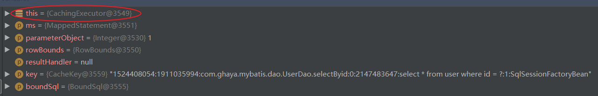

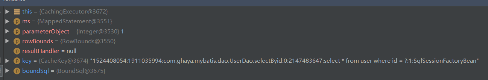

>  原因：因为mapper下面用的动态代理获取的sqlsession，所以每次获取回来的sqlsession都是新的会话
>
> 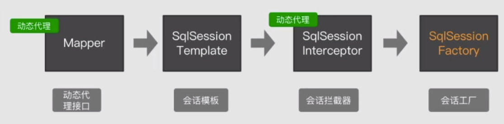
>
> 


> 解决方法：需要将两次查询放到同一个事务中
>
> 假如启用了事务，会在去getSqlSession之前，判断事务中是否存在会话，存在的话，则返回已有的SqlSession
>
> 


### 二级缓存（应用级缓存）

#### 描述

TransactionalCache

存储集合

过期清理

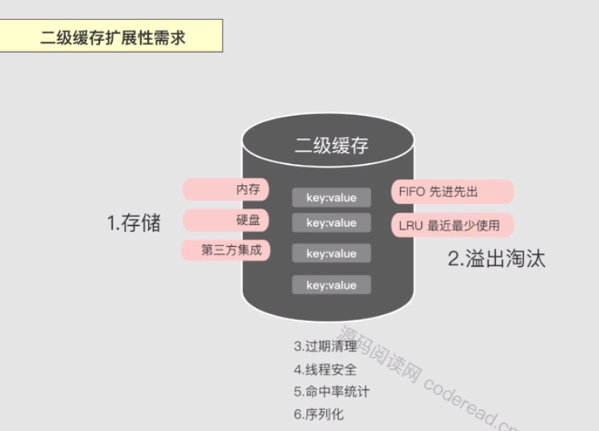


需要手动提交后才命中二级缓存，作用范围、生命周期与一级不同，可以跨线程

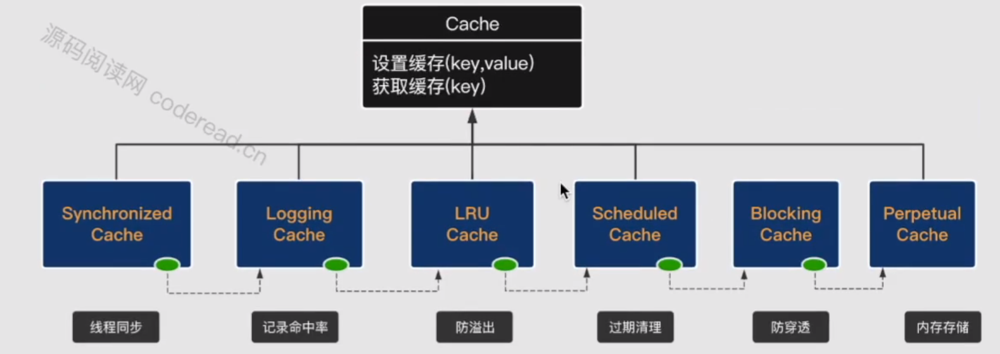

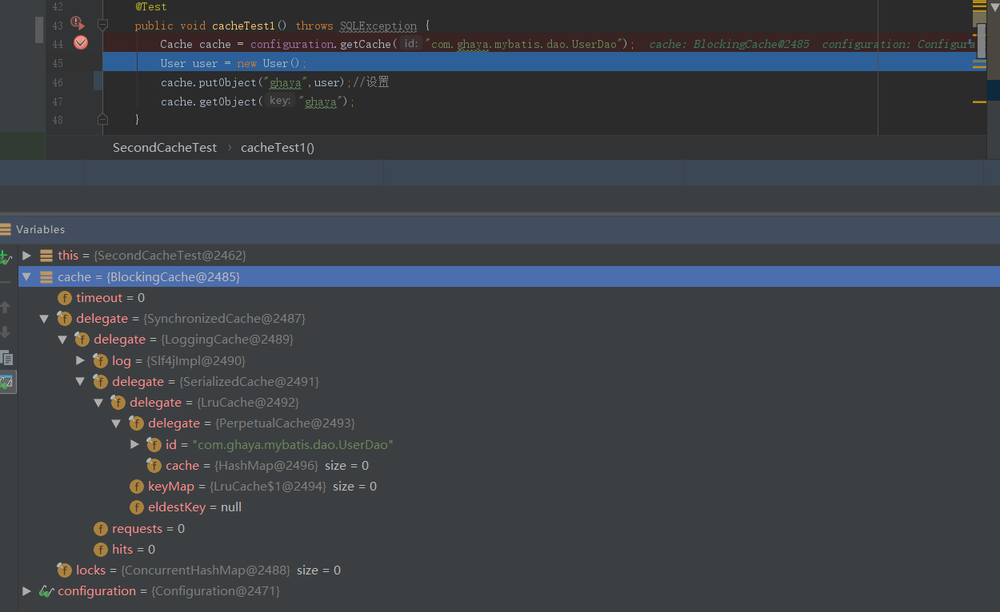


二级缓存结构

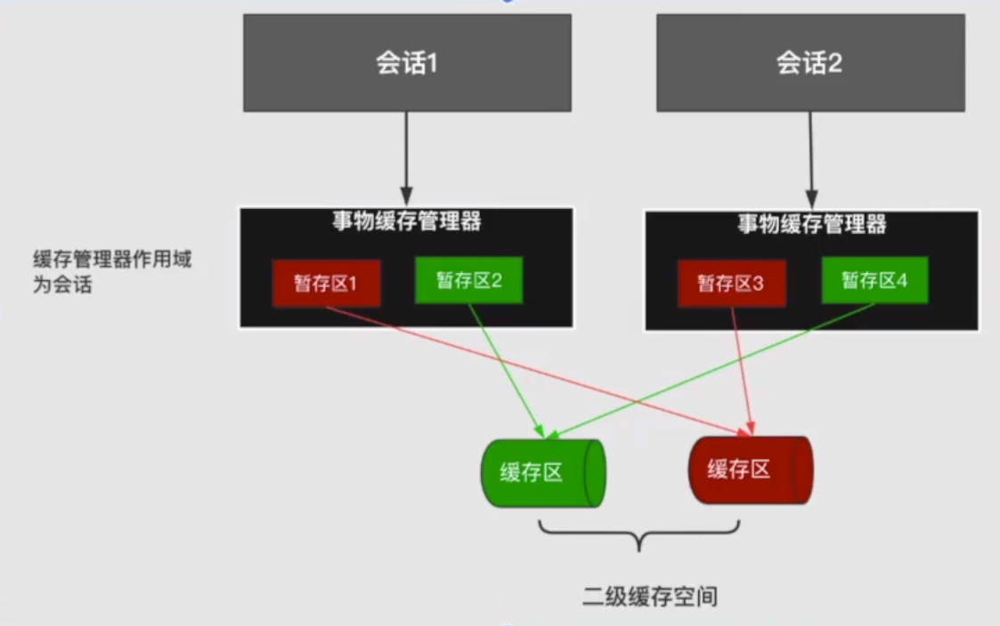

暂存区：

只暂存修改数据

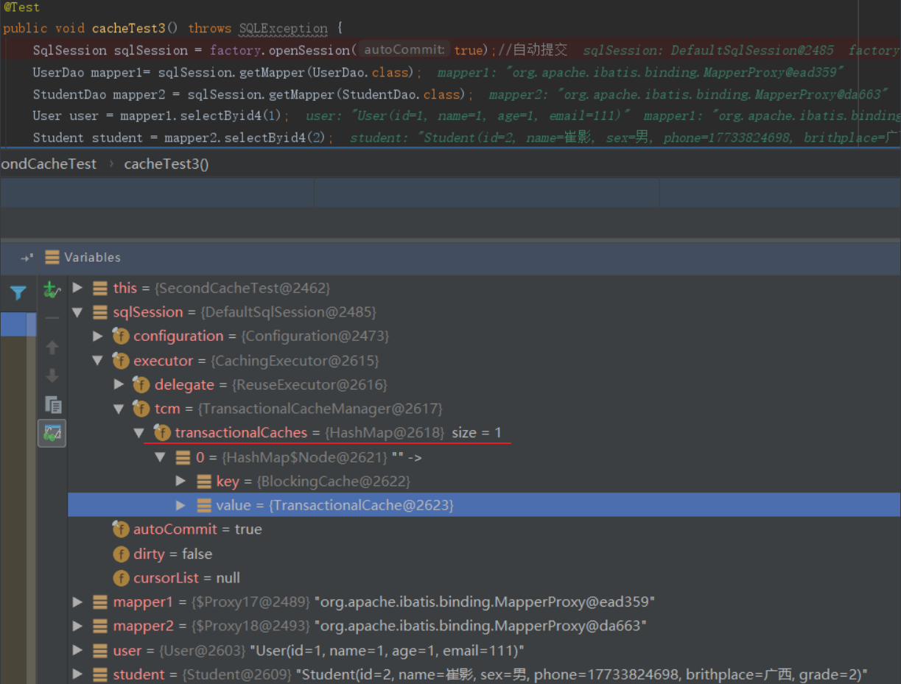

#### 命中条件

```markdown
## 前提
要开启二级缓存
要声明缓存空间
## 触发条件
1.会话手动提交后
2.Sql语句，参数相同
3.相同的statementID
4.RowBounds相同
```

##### 为何提交后才能命中缓存

跨线程，怕脏读

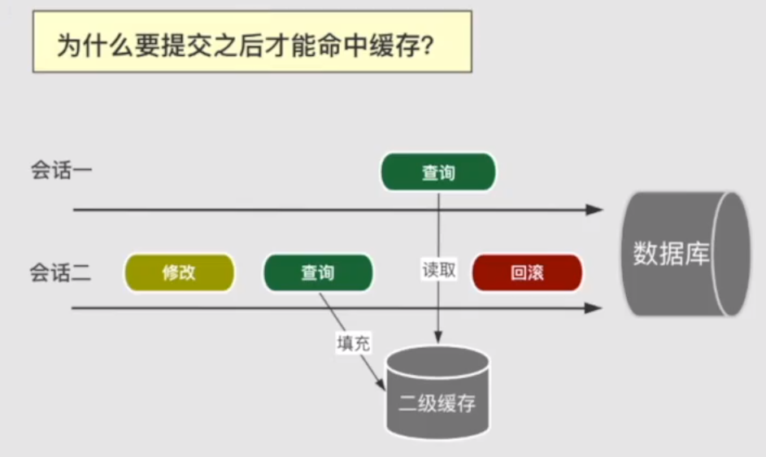

##### 二级缓存配置

###### 开启二级缓存

```markdown
1.二级缓存默认是开启的
<!-- 开启二级缓存  默认值为true -->
<setting name="cacheEnabled" value="true"/>
```


###### 声明缓存空间

```markdown
使用二级缓存必须声明缓存空间
1.在mapper接口上+@CacheNamespace
2.或者xml + <cache/>标签
3.两者都写的话，会产生两个缓存对象，解决办法使用
  <cache-ref namespace="com.ghaya.mybatis.dao.UserDao"/>
4.@CacheNamespaceRef(UserDao.class) 设置引用缓存空间
 比如ADao  BDao CDao 引用同一个空间，在清空缓存时会一起清空
```


#### 源码解析


##### 执行流程

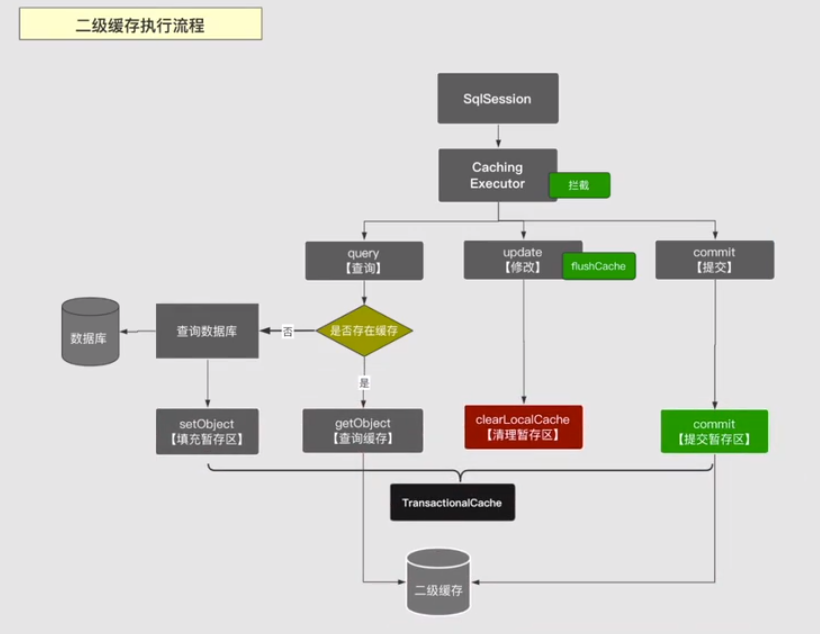


org.apache.ibatis.executor.CachingExecutor

```java

@Override
public <E> List<E> query(MappedStatement ms, Object parameterObject, RowBounds rowBounds, ResultHandler resultHandler, CacheKey key, BoundSql boundSql)
      throws SQLException {
    Cache cache = ms.getCache();//缓存
    if (cache != null) {
      flushCacheIfRequired(ms);//清空暂存区（实际上只修改了清理标志，防止脏读，让其他会话访问时返回null）
      if (ms.isUseCache() && resultHandler == null) {
        ensureNoOutParams(ms, boundSql);
        @SuppressWarnings("unchecked")
        List<E> list = (List<E>) tcm.getObject(cache, key);//把缓存空间作为key，获取二级缓存
        if (list == null) {
          list = delegate.query(ms, parameterObject, rowBounds, resultHandler, key, boundSql);//查询数据库
          tcm.putObject(cache, key, list); // issue #578 and #116
        }
        return list;
      }
    }
    return delegate.query(ms, parameterObject, rowBounds, resultHandler, key, boundSql);
  }
```


```java
  public void commit() {
    if (clearOnCommit) {
      delegate.clear();
    }
    flushPendingEntries();
    reset();
  }

private void flushPendingEntries() {
    for (Map.Entry<Object, Object> entry : entriesToAddOnCommit.entrySet()) {//便利暂存区，put进二级缓存空间
      delegate.putObject(entry.getKey(), entry.getValue());
    }
    for (Object entry : entriesMissedInCache) {
      if (!entriesToAddOnCommit.containsKey(entry)) {
        delegate.putObject(entry, null);
      }
    }
  }
```


## JDBC处理器 StatementHandler

### 描述

JDBC处理

每次执行SQL的时候会创建statment实例，走缓存是不走statement的


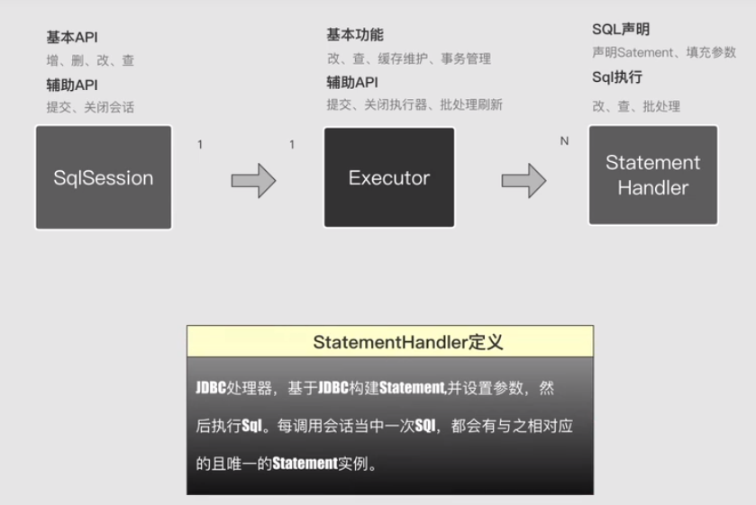

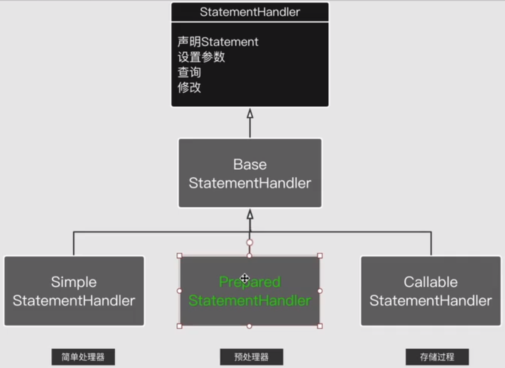

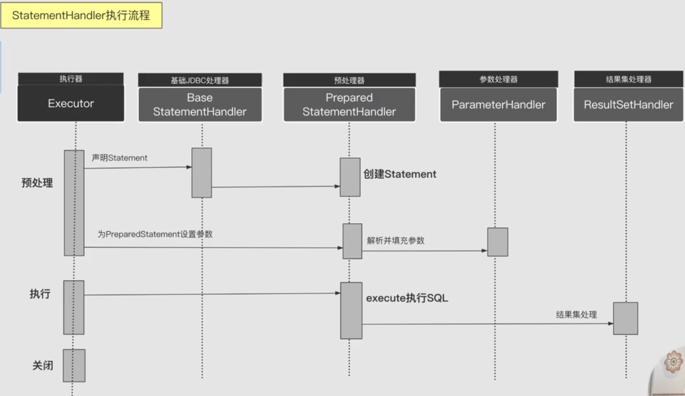

### 源码

```java
public interface StatementHandler {

//创建statement
  Statement prepare(Connection connection, Integer transactionTimeout)
      throws SQLException;
//预处理参数
  void parameterize(Statement statement)
      throws SQLException;
//执行批处理
  void batch(Statement statement)
      throws SQLException;
//执行修改（新增）
  int update(Statement statement)
      throws SQLException;
//查询
  <E> List<E> query(Statement statement, ResultHandler resultHandler)
      throws SQLException;
//查询游标
  <E> Cursor<E> queryCursor(Statement statement)
      throws SQLException;
//获取动态sql
  BoundSql getBoundSql();
//获取参数处理器
  ParameterHandler getParameterHandler();

}
```


#### 预处理   (设置参数 参数处理 填充参数)

SimpleExecutor.java

```java
@Override
public <E> List<E> doQuery(MappedStatement ms, Object parameter, RowBounds rowBounds, ResultHandler resultHandler, BoundSql boundSql) throws SQLException {
    Statement stmt = null;
    try {
      Configuration configuration = ms.getConfiguration();
      StatementHandler handler = configuration.newStatementHandler(wrapper, ms, parameter, rowBounds, resultHandler, boundSql);
      stmt = prepareStatement(handler, ms.getStatementLog());
      //3.执行语句  ResultSetHandler.java 结果集处理
      return handler.query(stmt, resultHandler);
    } finally {
      closeStatement(stmt);
    }
}
private Statement prepareStatement(StatementHandler handler, Log statementLog) throws SQLException {
    Statement stmt;
    Connection connection = getConnection(statementLog);
    //1.创建statement
    stmt = handler.prepare(connection, transaction.getTimeout());
	//2.设置参数  ParameterHandler.java 参数处理器
    handler.parameterize(stmt);
    return stmt;
  }
```

#### 

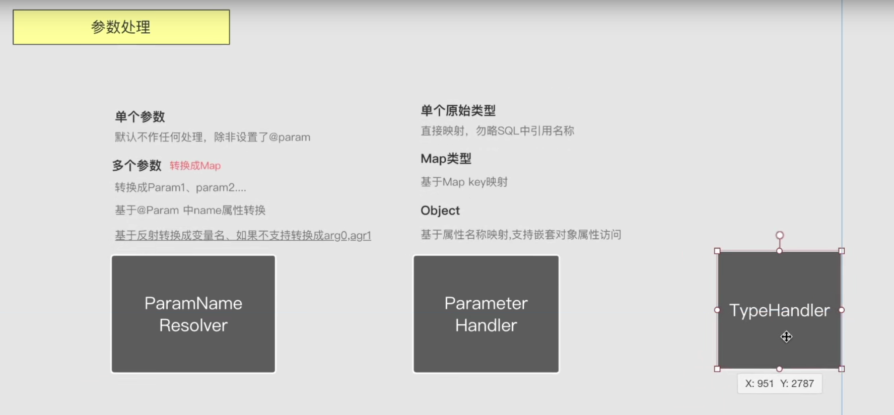

##### 单个参数

1.默认不转换处理

```java
@Select("select * from user where id = #{id}")
User selectByEveryThing1(Integer id);
```

2.除非设置@Param

```java
@Select("select * from user where id = #{pId}")
User selectByEveryThing2(@Param("pId") Integer id);
```

假如设为#{id}则，

Cause: org.apache.ibatis.binding.BindingException: Parameter 'id' not found. Available parameters are [pId, param1]

##### 多个参数

1.默认

arg0... 和 param1...

```java
    @Test
    public void test1() throws SQLException {
        UserDao mapper = sqlSession.getMapper(UserDao.class);
        User user3 = mapper.selectByEveryThing3("1","2",null);
        System.out.println(user3);
    }
```

```java
@Select("select * from user where name = #{arg0} and email = #{param2}")
	User selectByEveryThing3(String name,String email,Map map);
```

{arg2=null, arg1=2, arg0=1, param3=null, param1=1, param2=2}

---

2.@Param指定，

指定后arg则不存在，但param依然在

```java
@Select("select * from user where name = #{name} and email = #{email}")
User selectByEveryThing4(@Param("name")String name,@Param("email")String email,@Param("map")Map map);
```

{name=1, param3=null, map=null, param1=1, email=2, param2=2}

特殊情况

```java
@Select("select * from user where name = #{name} and email = #{arg1}")
User selectByEveryThing4(@Param("name")String name,String email,Map map);
```

{arg2=null, arg1=2, name=1, param3=null, param1=1, param2=2}

3.基于反射 arg

部分版本不支持，关于反射获取变量名，只有jdk1.8以上  并且添加了 -parameters参数


##### ParamNameResolver 参数转换过程

把Java Bean转换为JDBC参数，

结果为生成param参数对象，包含默认的，自定义参数名等集合

例：{arg2={this is key=这是值}, arg1=2, arg0=1, param3={this is key=这是值}, param1=1, param2=2}

##### 

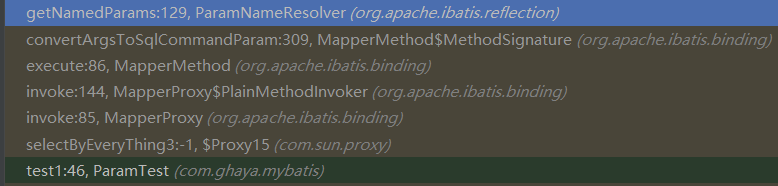

ParamNameResolver.java   

```java
//@Select("select * from user where name = #{arg0} and email = #{param2}")
//User selectByEveryThing3(String name,String email,@Param("map")Map map);

//        HashMap hashMap = new HashMap();
//        hashMap.put("this is key","这是值");
//        User user3 = mapper.selectByEveryThing3("1","2",hashMap);
// 转换成默认或者附带的参数
public Object getNamedParams(Object[] args) {
    //args  ["1","2",hahsMap{"this is key":"这是值"}]
    //names [SortedMap{"0":"arg0","1":"arg1","2":"arg2"}]  处理前只有基于反射给的三个参数名
  final int paramCount = names.size();
  if (args == null || paramCount == 0) {
    return null;
  } else if (!hasParamAnnotation && paramCount == 1) {
    return args[names.firstKey()];
  } else {
    final Map<String, Object> param = new ParamMap<>();
    int i = 0;
    for (Map.Entry<Integer, String> entry : names.entrySet()) {
      param.put(entry.getValue(), args[entry.getKey()]);
      // add generic param names (param1, param2, ...)
      final String genericParamName = GENERIC_NAME_PREFIX + (i + 1);
      // ensure not to overwrite parameter named with @Param
      if (!names.containsValue(genericParamName)) {
        param.put(genericParamName, args[entry.getKey()]);
      }
      i++;
    }
    //处理后添加默认  {arg2={this is key=这是值}, arg1=2, arg0=1, param3={this is key=这是值}, param1=1, param2=2}
    //有用@param指定  {arg1=2, arg0=1, map={this is key=这是值}, param3={this is key=这是值}, param1=1, param2=2}
    return param;
  }
}
```


##### ParameterHandler 参数映射 填充

DefaultParameterHandler.java

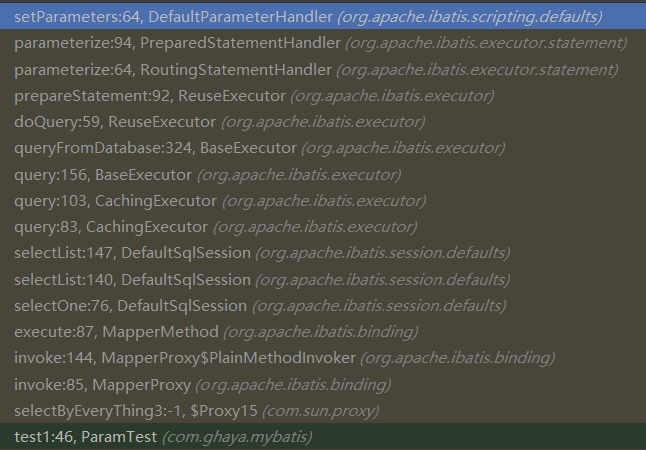

```java
@Override
public void setParameters(PreparedStatement ps) {
  ErrorContext.instance().activity("setting parameters").object(mappedStatement.getParameterMap().getId());
    //boundSql 包含替换好？的SQL语句，以及语句需要的参数列表
  List<ParameterMapping> parameterMappings = boundSql.getParameterMappings();
  if (parameterMappings != null) {
      //循环参数列表
    for (int i = 0; i < parameterMappings.size(); i++) {
      ParameterMapping parameterMapping = parameterMappings.get(i);
      if (parameterMapping.getMode() != ParameterMode.OUT) {
        Object value;
        String propertyName = parameterMapping.getProperty();
        if (boundSql.hasAdditionalParameter(propertyName)) { // issue #448 ask first for additional params
          //<foreach>
          value = boundSql.getAdditionalParameter(propertyName);
        } else if (parameterObject == null) {
          value = null;
        } else if (typeHandlerRegistry.hasTypeHandler(parameterObject.getClass())) {
          value = parameterObject;
        } else {
            //parameterObject 包含参数名arg、param、@param自定义参数名的实际值集合
          MetaObject metaObject = configuration.newMetaObject(parameterObject);
            //支持多种属性结构获取  user.pro[1].age
          value = metaObject.getValue(propertyName);
        }
        TypeHandler typeHandler = parameterMapping.getTypeHandler();
        JdbcType jdbcType = parameterMapping.getJdbcType();
        if (value == null && jdbcType == null) {
          jdbcType = configuration.getJdbcTypeForNull();
        }
        try {
            //设值
          typeHandler.setParameter(ps, i + 1, value, jdbcType);
        } catch (TypeException | SQLException e) {
          throw new TypeException("Could not set parameters for mapping: " + parameterMapping + ". Cause: " + e, e);
        }
      }
    }
  }
}
```

boundSql

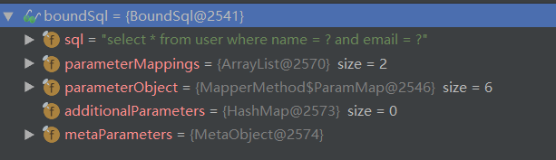

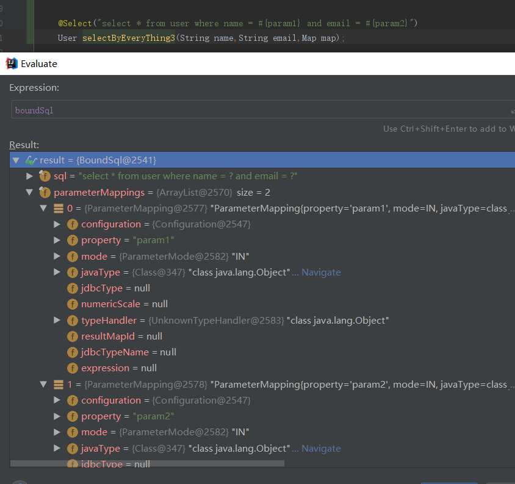

BaseTypeHandler.java


UnknownTypeHandler.java

```java
@Override
public void setNonNullParameter(PreparedStatement ps, int i, Object parameter, JdbcType jdbcType)
    throws SQLException {
  TypeHandler handler = resolveTypeHandler(parameter, jdbcType);
  handler.setParameter(ps, i, parameter, jdbcType);
}
```


#### 执行 

##### ResultSetHandler 结果集处理

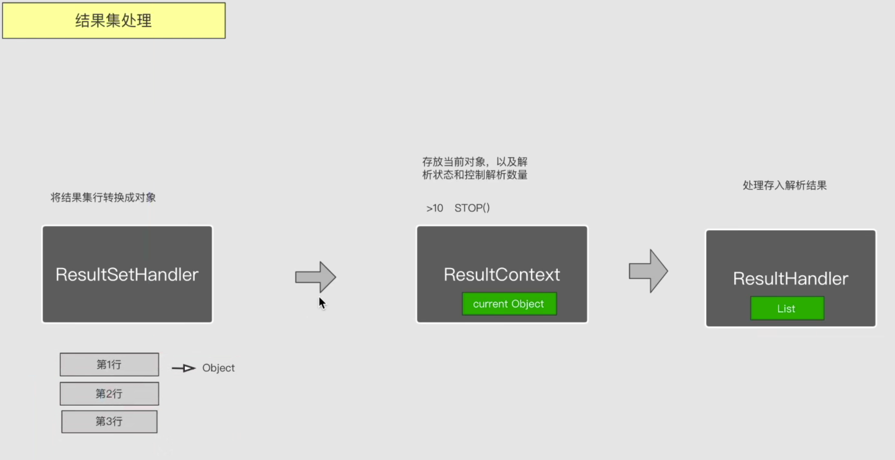


ResultContext.java 

处理结果集用的，有一些对结果集获取和限制的方法


结果集处理

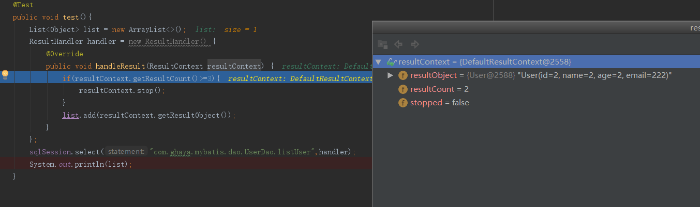


SimpleStatementHandler.java

```java
@Override
public <E> List<E> query(Statement statement, ResultHandler resultHandler) throws SQLException {
  String sql = boundSql.getSql();
  statement.execute(sql);
  return resultSetHandler.handleResultSets(statement);
}
```

DefaultResultSetHandler.java

所有结果集映射逻辑都在这个里面

```java

public class DefaultResultSetHandler implements ResultSetHandler {
    //...
    //----------------
    //处理多个结果集 
    @Override
    public List<Object> handleResultSets(Statement stmt) throws SQLException {
        ErrorContext.instance().activity("handling results").object(mappedStatement.getId());

        final List<Object> multipleResults = new ArrayList<>();

        int resultSetCount = 0;
        //获取结果集  @图1
        ResultSetWrapper rsw = getFirstResultSet(stmt);

        List<ResultMap> resultMaps = mappedStatement.getResultMaps();
        int resultMapCount = resultMaps.size();
        validateResultMapsCount(rsw, resultMapCount);
        while (rsw != null && resultMapCount > resultSetCount) {
            ResultMap resultMap = resultMaps.get(resultSetCount);
            //处理结果集
            handleResultSet(rsw, resultMap, multipleResults, null);
            rsw = getNextResultSet(stmt);
            cleanUpAfterHandlingResultSet();
            resultSetCount++;
        }
        //多结果集分支
        String[] resultSets = mappedStatement.getResultSets();
        if (resultSets != null) {
            while (rsw != null && resultSetCount < resultSets.length) {
                ResultMapping parentMapping = nextResultMaps.get(resultSets[resultSetCount]);
                if (parentMapping != null) {
                    String nestedResultMapId = parentMapping.getNestedResultMapId();
                    ResultMap resultMap = configuration.getResultMap(nestedResultMapId);
                    handleResultSet(rsw, resultMap, null, parentMapping);
                }
                rsw = getNextResultSet(stmt);
                cleanUpAfterHandlingResultSet();
                resultSetCount++;
            }
        }

        return collapseSingleResultList(multipleResults);
    }

    //----------------
    //处理单个结果集
    //一般都只有一个结果集
    private void handleResultSet(ResultSetWrapper rsw,
                                 ResultMap resultMap,
                                 List<Object> multipleResults,
                                 ResultMapping parentMapping) throws SQLException {
        try {
            if (parentMapping != null) {
                handleRowValues(rsw, resultMap, null, RowBounds.DEFAULT, parentMapping);
            } else {
                if (resultHandler == null) {
                    //ResultHandler 把结果集放进去  
                    DefaultResultHandler defaultResultHandler = new DefaultResultHandler(objectFactory);
                    //处理结果行
                    handleRowValues(rsw, resultMap, defaultResultHandler, rowBounds, null);
                    multipleResults.add(defaultResultHandler.getResultList());
                } else {
                    handleRowValues(rsw, resultMap, resultHandler, rowBounds, null);
                }
            }
        } finally {
            // issue #228 (close resultsets)
            closeResultSet(rsw.getResultSet());
        }
    }

    //----------------
    public void handleRowValues(ResultSetWrapper rsw,
                                ResultMap resultMap,
                                ResultHandler<?> resultHandler,
                                RowBounds rowBounds,
                                ResultMapping parentMapping) throws SQLException {
        if (resultMap.hasNestedResultMaps()) {
            ensureNoRowBounds();
            checkResultHandler();
            //多结果集处理逻辑  嵌套查询等
            handleRowValuesForNestedResultMap(rsw, resultMap, resultHandler, rowBounds, parentMapping);
        } else {
            //简单结果集处理 √
            handleRowValuesForSimpleResultMap(rsw, resultMap, resultHandler, rowBounds, parentMapping);
        }
    }

    //----------------
    //简单结果集处理
    private void handleRowValuesForSimpleResultMap(ResultSetWrapper rsw,
                                                   ResultMap resultMap,
                                                   ResultHandler<?> resultHandler,
                                                   RowBounds rowBounds,
                                                   ResultMapping parentMapping) throws SQLException {
        //ResultContext
        DefaultResultContext<Object> resultContext = new DefaultResultContext<>();
        ResultSet resultSet = rsw.getResultSet();
        skipRows(resultSet, rowBounds);//跳过指定行  分页等
        while (shouldProcessMoreRows(resultContext, rowBounds) && !resultSet.isClosed() && resultSet.next()) {
            ResultMap discriminatedResultMap = resolveDiscriminatedResultMap(resultSet, resultMap, null);
            Object rowValue = getRowValue(rsw, discriminatedResultMap, null);//封装对象
            storeObject(resultHandler, resultContext, rowValue, parentMapping, resultSet);
        }
    }

    //----------------
    //获取行数据
    private Object getRowValue(ResultSetWrapper rsw,
                               ResultMap resultMap,
                               String columnPrefix) throws SQLException {
        final ResultLoaderMap lazyLoader = new ResultLoaderMap();
        //创建结果对象  基于xml中配置的type属性值
        Object rowValue = createResultObject(rsw, resultMap, lazyLoader, columnPrefix);
        if (rowValue != null && !hasTypeHandlerForResultObject(rsw, resultMap.getType())) {
            final MetaObject metaObject = configuration.newMetaObject(rowValue);
            boolean foundValues = this.useConstructorMappings;
            //自动填充
            if (shouldApplyAutomaticMappings(resultMap, false)) {
                foundValues = applyAutomaticMappings(rsw, resultMap, metaObject, columnPrefix) || foundValues;
            }
            //手动填充
            foundValues = applyPropertyMappings(rsw, resultMap, metaObject, lazyLoader, columnPrefix) || foundValues;
            foundValues = lazyLoader.size() > 0 || foundValues;
            rowValue = foundValues || configuration.isReturnInstanceForEmptyRow() ? rowValue : null;
        }
        return rowValue;
    }

    //----------------
    //手动填充
    private boolean applyPropertyMappings(ResultSetWrapper rsw,
                                          ResultMap resultMap,
                                          MetaObject metaObject,
                                          ResultLoaderMap lazyLoader,
                                          String columnPrefix) throws SQLException {
        final List<String> mappedColumnNames = rsw.getMappedColumnNames(resultMap, columnPrefix);
        boolean foundValues = false;
        final List<ResultMapping> propertyMappings = resultMap.getPropertyResultMappings();
        for (ResultMapping propertyMapping : propertyMappings) {
            String column = prependPrefix(propertyMapping.getColumn(), columnPrefix);
            if (propertyMapping.getNestedResultMapId() != null) {
                // the user added a column attribute to a nested result map, ignore it
                column = null;
            } 
            if (propertyMapping.isCompositeResult()
                    || (column != null && mappedColumnNames.contains(column.toUpperCase(Locale.ENGLISH)))
                    || propertyMapping.getResultSet() != null) {
                Object value = getPropertyMappingValue(rsw.getResultSet(), metaObject, propertyMapping, lazyLoader, columnPrefix);
                // issue #541 make property optional
                final String property = propertyMapping.getProperty();
                if (property == null) {
                    continue;
                } else if (value == DEFERRED) {
                    foundValues = true;
                    continue;
                }
                if (value != null) {
                    foundValues = true;
                }
                if (value != null || (configuration.isCallSettersOnNulls() && !metaObject.getSetterType(property).isPrimitive())) {
                    // gcode issue #377, call setter on nulls (value is not 'found')
                    metaObject.setValue(property, value);
                }
            }
        }
        return foundValues;
    }


}
```

> 图1

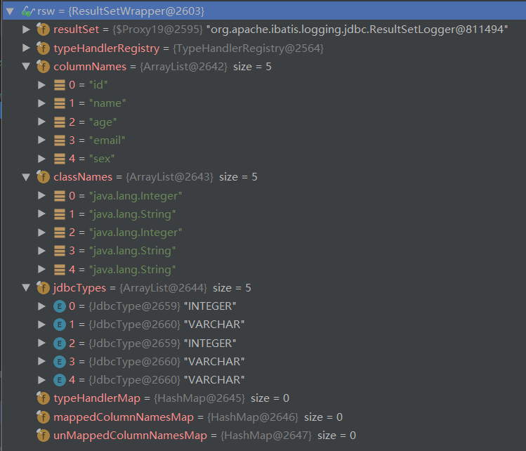

```xml
<!-- autoMapping = "true"  自动映射 
	基于type类属性名词和返回字段列名称一一对应-->	
<!-- result 指定列  手动映射
	基于result标签配置 -->

    <resultMap id="userResultMap" type="com.ghaya.mybatis.pojo.UserVo" autoMapping="true">
        <result property="name" column="name"></result>
    </resultMap>
```


## 反射工具类 MeTaObject

### 描述

mybatis提供的反射工具类，

作用：开发一些底层javabean组件时可以使用。


示例流程

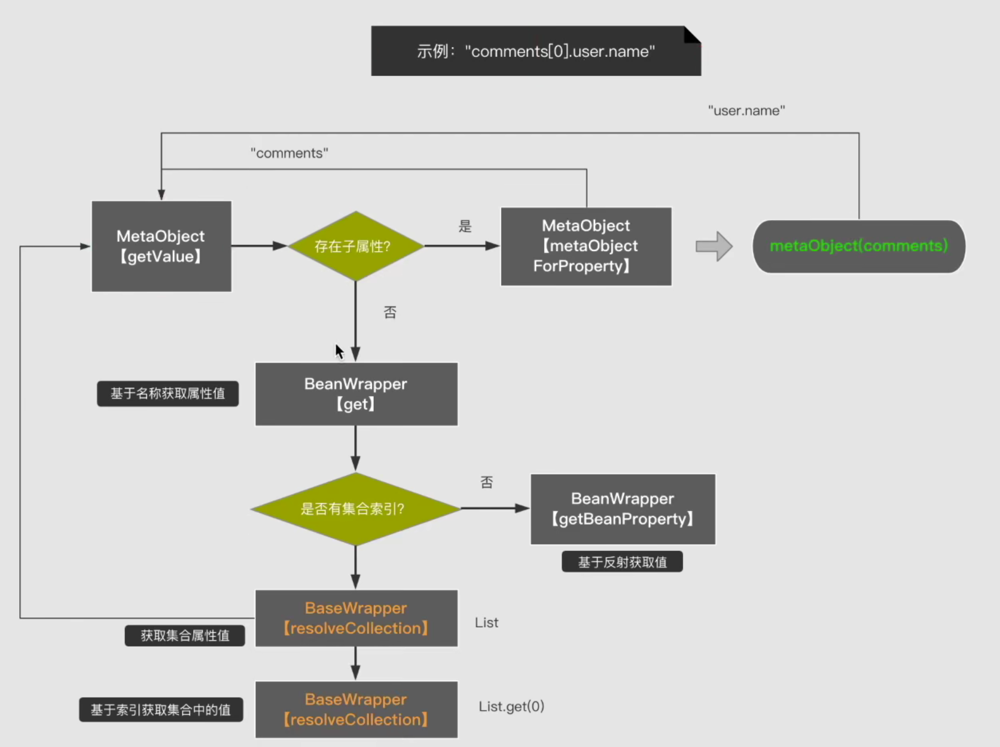

### 源码

MetaObject.java

```java
 public Object getValue(String name) {
    PropertyTokenizer prop = new PropertyTokenizer(name);
    if (prop.hasNext()) {
      MetaObject metaValue = metaObjectForProperty(prop.getIndexedName());
      if (metaValue == SystemMetaObject.NULL_META_OBJECT) {
        return null;
      } else {
        return metaValue.getValue(prop.getChildren());
      }
    } else {
      return objectWrapper.get(prop);
    }
  }
```


分词器    PropertyTokenizer.java

表示式由分词解析器处理

```java
public class PropertyTokenizer implements Iterator<PropertyTokenizer> {
  private String name;
  private final String indexedName;
  private String index;
  private final String children;

  public PropertyTokenizer(String fullname) {
    int delim = fullname.indexOf('.');
    if (delim > -1) {
      name = fullname.substring(0, delim);
      children = fullname.substring(delim + 1);
    } else {
      name = fullname;
      children = null;
    }
    indexedName = name;
    delim = name.indexOf('[');
    if (delim > -1) {
      index = name.substring(delim + 1, name.length() - 1);
      name = name.substring(0, delim);
    }
  }
   
  @Override
  public PropertyTokenizer next() {
    return new PropertyTokenizer(children);
  }
}

```

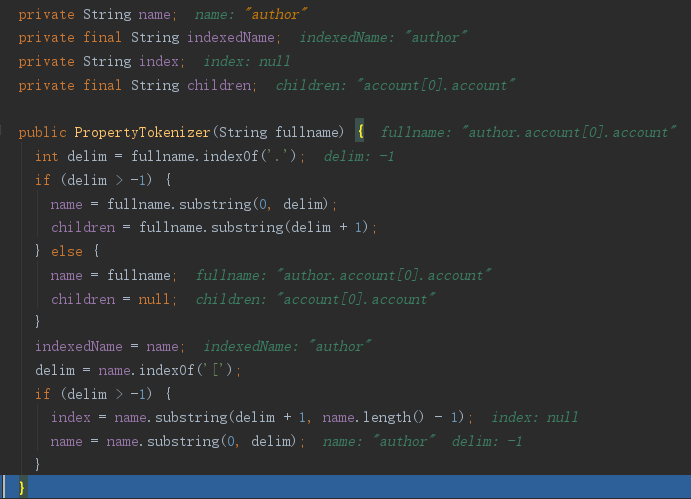


