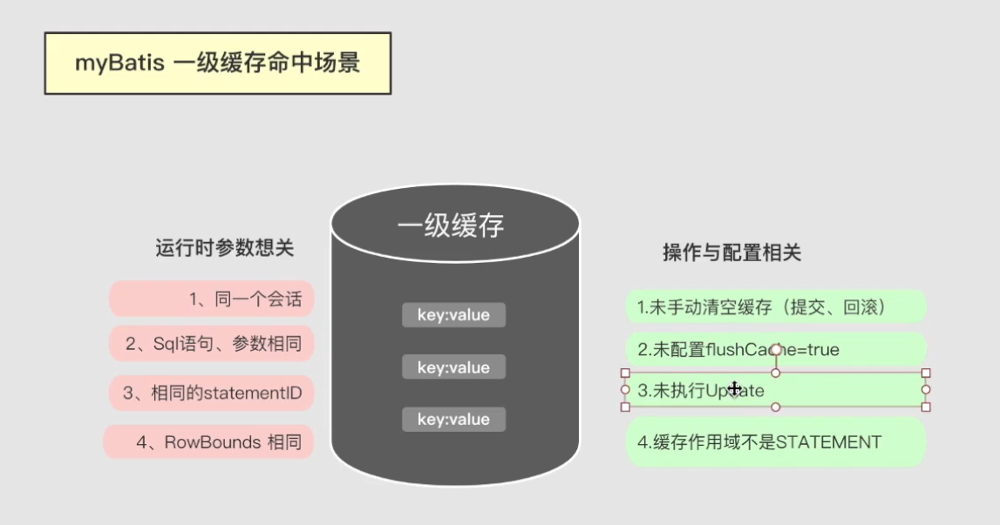

# Mybatis


## 会话


## 执行器

### 相关结构


### 简单执行器

BaseExecutor

### 可重用执行器

ReuseExecutor

```markdown
相同sql只会编译一次，参数不一样也会重用
```


### 批处理执行器

BatchExecutor


## 缓存
### 一级缓存（会话级缓存）

​	PerpetualCache

​	与会话相关，参数条件相关，提交修改都会清空

#### 命中条件

##### 操作配置相关




```markdown
1. sql与参数相同
2. 必须是相同的statementID(DAO方法是同一个)
3. sqlSession必须一样（会话级缓存）
4. RowBounds 分页行范围必须相同
```

```markdown
# 涉及清空缓存的都搞不了
1. 未手动清空
2. 未调用flushCache=true的查询
3. mapper执行update，commit，rollback方法也会清空缓存
4. localCacheScope未设置成STATEMENT(将一级缓存的作用域改为嵌套查询子查询等查询，普通查询不走一级缓存)
```

#### 源码解析


BaseExecutor

  

第一次查询时

会将sql和传参生成一个缓存 CacheKey  并且设置在一级缓存中

```java
@Override
public <E> List<E> query(MappedStatement ms, Object parameter, RowBounds rowBounds, ResultHandler resultHandler) throws SQLException {
  BoundSql boundSql = ms.getBoundSql(parameter);
  //生成并设置缓存
  CacheKey key = createCacheKey(ms, parameter, rowBounds, boundSql);
  return query(ms, parameter, rowBounds, resultHandler, key, boundSql);
}
```

第二次查询时会再去查询缓存localCache

```java
@SuppressWarnings("unchecked")
@Override
public <E> List<E> query(MappedStatement ms, Object parameter, RowBounds rowBounds, ResultHandler resultHandler, CacheKey key, BoundSql boundSql) throws SQLException {
  ErrorContext.instance().resource(ms.getResource()).activity("executing a query").object(ms.getId());
  if (closed) {
    throw new ExecutorException("Executor was closed.");
  }
  if (queryStack == 0 && ms.isFlushCacheRequired()) {
    clearLocalCache();
  }
  List<E> list;
  try {
    queryStack++;
    // 查缓存
    list = resultHandler == null ? (List<E>) localCache.getObject(key) : null;
    if (list != null) {
      handleLocallyCachedOutputParameters(ms, key, parameter, boundSql);
    } else {
      list = queryFromDatabase(ms, parameter, rowBounds, resultHandler, key, boundSql);
    }
  } finally {
    queryStack--;
  }
  if (queryStack == 0) {
    for (DeferredLoad deferredLoad : deferredLoads) {
      deferredLoad.load();
    }
    // issue #601
    deferredLoads.clear();
    if (configuration.getLocalCacheScope() == LocalCacheScope.STATEMENT) {
      // issue #482
      clearLocalCache();
    }
  }
  return list;
}
```


sqlsessiond不是线程安全的


##### 清空缓存方法

clearLocalCache()


在嵌套子查询中不会清空一级缓存，因为子查询会依赖一级缓存


#### 失效问题

spring配置文件整合mybatis  每次查询都会发起一个新的会话

在执行器中断点发现，两次查询并不是同一个执行器。sqlsession和执行器是1:1的关系，所以他们也不是一个sqlsession

所以也调用不到同一个缓存，


>  原因：因为mapper下面用的动态代理获取的sqlsession，所以每次获取回来的sqlsession都是新的会话
>
> 
>
> 


> 解决方法：需要将两次查询放到同一个事务中
>
> 假如启用了事务，会在去getSqlSession之前，判断事务中是否存在会话，存在的话，则返回已有的SqlSession
>
> 


### 二级缓存（应用级缓存）

需要手动提交后才命中二级缓存，作用范围、生命周期与一级不同，可以跨线程


#### 命中条件

```markdown
## 前提
要开启二级缓存
要声明缓存空间
## 触发条件
1.会话手动提交后
2.Sql语句，参数相同
3.相同的statementID
4.RowBounds相同
```


##### 二级缓存配置

###### 开启二级缓存

```markdown
1.二级缓存默认是开启的
<!-- 开启二级缓存  默认值为true -->
<setting name="cacheEnabled" value="true"/>
```


###### 声明缓存空间

```markdown
使用二级缓存必须声明缓存空间
1.在mapper接口上+@CacheNamespace
2.或者xml + <cache/>标签
3.两者都写的话，会产生两个缓存对象，解决办法使用
  <cache-ref namespace="com.ghaya.mybatis.dao.UserDao"/>
4.@CacheNamespaceRef(UserDao.class) 设置引用缓存空间
 比如ADao  BDao CDao 引用同一个空间，在清空缓存时会一起清空
```


#### 源码解析

##### 为何提交后才能命中缓存

跨线程，怕脏读


二级缓存结构


暂存区：

只暂存修改数据


#### 执行流程


org.apache.ibatis.executor.CachingExecutor

```java

@Override
public <E> List<E> query(MappedStatement ms, Object parameterObject, RowBounds rowBounds, ResultHandler resultHandler, CacheKey key, BoundSql boundSql)
      throws SQLException {
    Cache cache = ms.getCache();//缓存
    if (cache != null) {
      flushCacheIfRequired(ms);//清空暂存区（实际上只修改了清理标志，防止脏读，让其他会话访问时返回null）
      if (ms.isUseCache() && resultHandler == null) {
        ensureNoOutParams(ms, boundSql);
        @SuppressWarnings("unchecked")
        List<E> list = (List<E>) tcm.getObject(cache, key);//把缓存空间作为key，获取二级缓存
        if (list == null) {
          list = delegate.query(ms, parameterObject, rowBounds, resultHandler, key, boundSql);//查询数据库
          tcm.putObject(cache, key, list); // issue #578 and #116
        }
        return list;
      }
    }
    return delegate.query(ms, parameterObject, rowBounds, resultHandler, key, boundSql);
  }
```


```java
  public void commit() {
    if (clearOnCommit) {
      delegate.clear();
    }
    flushPendingEntries();
    reset();
  }

private void flushPendingEntries() {
    for (Map.Entry<Object, Object> entry : entriesToAddOnCommit.entrySet()) {//便利暂存区，put进二级缓存空间
      delegate.putObject(entry.getKey(), entry.getValue());
    }
    for (Object entry : entriesMissedInCache) {
      if (!entriesToAddOnCommit.containsKey(entry)) {
        delegate.putObject(entry, null);
      }
    }
  }
```


## StatementHandler结构


