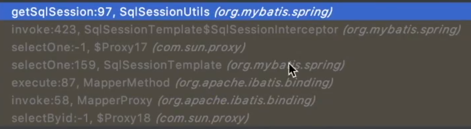

# Mybatis


## 会话 SqlSession


## 执行器 Executor

处理一些共性

### 相关结构


### 简单执行器

BaseExecutor

### 可重用执行器

ReuseExecutor

```markdown
相同sql只会编译一次，参数不一样也会重用
```


### 批处理执行器

BatchExecutor


## 缓存 Cache
### 一级缓存（会话级缓存）

#### 特性

​	PerpetualCache

​	与会话相关，sql，参数条件相关，提交修改都会清空

#### 命中条件


```markdown
1. sql与参数相同
2. 必须是相同的statementID(DAO方法是同一个)
3. sqlSession必须一样（会话级缓存）
4. RowBounds 分页行范围必须相同
```

```markdown
# 涉及清空缓存的都搞不了
1. 未手动清空
2. 未调用flushCache=true的查询
3. mapper执行update，commit，rollback方法也会清空缓存
4. localCacheScope未设置成STATEMENT(将一级缓存的作用域改为嵌套查询子查询等查询，普通查询不走一级缓存)
```

#### 源码解析


BaseExecutor

  

第一次查询时

会将sql和传参生成一个缓存 CacheKey  并且设置在一级缓存中

```java
@Override
public <E> List<E> query(MappedStatement ms, Object parameter, RowBounds rowBounds, ResultHandler resultHandler) throws SQLException {
  BoundSql boundSql = ms.getBoundSql(parameter);
  //生成并设置缓存
  CacheKey key = createCacheKey(ms, parameter, rowBounds, boundSql);
  return query(ms, parameter, rowBounds, resultHandler, key, boundSql);
}
```

第二次查询时会再去查询缓存localCache

```java
@SuppressWarnings("unchecked")
@Override
public <E> List<E> query(MappedStatement ms, Object parameter, RowBounds rowBounds, ResultHandler resultHandler, CacheKey key, BoundSql boundSql) throws SQLException {
  ErrorContext.instance().resource(ms.getResource()).activity("executing a query").object(ms.getId());
  if (closed) {
    throw new ExecutorException("Executor was closed.");
  }
  if (queryStack == 0 && ms.isFlushCacheRequired()) {
    clearLocalCache();
  }
  List<E> list;
  try {
    queryStack++;
    // 查缓存
    list = resultHandler == null ? (List<E>) localCache.getObject(key) : null;
    if (list != null) {
      handleLocallyCachedOutputParameters(ms, key, parameter, boundSql);
    } else {
      list = queryFromDatabase(ms, parameter, rowBounds, resultHandler, key, boundSql);
    }
  } finally {
    queryStack--;
  }
  if (queryStack == 0) {
    for (DeferredLoad deferredLoad : deferredLoads) {
      deferredLoad.load();
    }
    // issue #601
    deferredLoads.clear();
    if (configuration.getLocalCacheScope() == LocalCacheScope.STATEMENT) {
      // issue #482
      clearLocalCache();
    }
  }
  return list;
}
```


sqlsessiond不是线程安全的


##### 清空缓存方法

clearLocalCache()


在嵌套子查询中不会清空一级缓存，因为子查询会依赖一级缓存


#### 失效问题

spring配置文件整合mybatis  每次查询都会发起一个新的会话

在执行器中断点发现，两次查询并不是同一个执行器。sqlsession和执行器是1:1的关系，所以他们也不是一个sqlsession

所以也调用不到同一个缓存，


>  原因：因为mapper下面用的动态代理获取的sqlsession，所以每次获取回来的sqlsession都是新的会话
>
> 
>
> 


> 解决方法：需要将两次查询放到同一个事务中
>
> 假如启用了事务，会在去getSqlSession之前，判断事务中是否存在会话，存在的话，则返回已有的SqlSession
>
> 


### 二级缓存（应用级缓存）

#### 特性

TransactionalCache

存储集合

过期清理


需要手动提交后才命中二级缓存，作用范围、生命周期与一级不同，可以跨线程


二级缓存结构


暂存区：

只暂存修改数据


#### 命中条件

```markdown
## 前提
要开启二级缓存
要声明缓存空间
## 触发条件
1.会话手动提交后
2.Sql语句，参数相同
3.相同的statementID
4.RowBounds相同
```

##### 为何提交后才能命中缓存

跨线程，怕脏读


##### 二级缓存配置

###### 开启二级缓存

```markdown
1.二级缓存默认是开启的
<!-- 开启二级缓存  默认值为true -->
<setting name="cacheEnabled" value="true"/>
```


###### 声明缓存空间

```markdown
使用二级缓存必须声明缓存空间
1.在mapper接口上+@CacheNamespace
2.或者xml + <cache/>标签
3.两者都写的话，会产生两个缓存对象，解决办法使用
  <cache-ref namespace="com.ghaya.mybatis.dao.UserDao"/>
4.@CacheNamespaceRef(UserDao.class) 设置引用缓存空间
 比如ADao  BDao CDao 引用同一个空间，在清空缓存时会一起清空
```


#### 源码解析


##### 执行流程


org.apache.ibatis.executor.CachingExecutor

```java

@Override
public <E> List<E> query(MappedStatement ms, Object parameterObject, RowBounds rowBounds, ResultHandler resultHandler, CacheKey key, BoundSql boundSql)
      throws SQLException {
    Cache cache = ms.getCache();//缓存
    if (cache != null) {
      flushCacheIfRequired(ms);//清空暂存区（实际上只修改了清理标志，防止脏读，让其他会话访问时返回null）
      if (ms.isUseCache() && resultHandler == null) {
        ensureNoOutParams(ms, boundSql);
        @SuppressWarnings("unchecked")
        List<E> list = (List<E>) tcm.getObject(cache, key);//把缓存空间作为key，获取二级缓存
        if (list == null) {
          list = delegate.query(ms, parameterObject, rowBounds, resultHandler, key, boundSql);//查询数据库
          tcm.putObject(cache, key, list); // issue #578 and #116
        }
        return list;
      }
    }
    return delegate.query(ms, parameterObject, rowBounds, resultHandler, key, boundSql);
  }
```


```java
  public void commit() {
    if (clearOnCommit) {
      delegate.clear();
    }
    flushPendingEntries();
    reset();
  }

private void flushPendingEntries() {
    for (Map.Entry<Object, Object> entry : entriesToAddOnCommit.entrySet()) {//便利暂存区，put进二级缓存空间
      delegate.putObject(entry.getKey(), entry.getValue());
    }
    for (Object entry : entriesMissedInCache) {
      if (!entriesToAddOnCommit.containsKey(entry)) {
        delegate.putObject(entry, null);
      }
    }
  }
```


## JDBC处理器 StatementHandler

### 描述

JDBC处理

每次执行SQL的时候会创建statment实例，走缓存是不走statement的


### 源码

```java
public interface StatementHandler {

//创建statement
  Statement prepare(Connection connection, Integer transactionTimeout)
      throws SQLException;
//预处理参数
  void parameterize(Statement statement)
      throws SQLException;
//执行批处理
  void batch(Statement statement)
      throws SQLException;
//执行修改（新增）
  int update(Statement statement)
      throws SQLException;
//查询
  <E> List<E> query(Statement statement, ResultHandler resultHandler)
      throws SQLException;
//查询游标
  <E> Cursor<E> queryCursor(Statement statement)
      throws SQLException;
//获取动态sql
  BoundSql getBoundSql();
//获取参数处理器
  ParameterHandler getParameterHandler();

}
```


#### 预处理

SimpleExecutor.java

```java
@Override
public <E> List<E> doQuery(MappedStatement ms, Object parameter, RowBounds rowBounds, ResultHandler resultHandler, BoundSql boundSql) throws SQLException {
    Statement stmt = null;
    try {
      Configuration configuration = ms.getConfiguration();
      StatementHandler handler = configuration.newStatementHandler(wrapper, ms, parameter, rowBounds, resultHandler, boundSql);
      stmt = prepareStatement(handler, ms.getStatementLog());
      //3.执行语句  ResultSetHandler.java 结果集处理
      return handler.query(stmt, resultHandler);
    } finally {
      closeStatement(stmt);
    }
}
private Statement prepareStatement(StatementHandler handler, Log statementLog) throws SQLException {
    Statement stmt;
    Connection connection = getConnection(statementLog);
    //1.创建statement
    stmt = handler.prepare(connection, transaction.getTimeout());
	//2.设置参数  ParameterHandler.java 参数处理器
    handler.parameterize(stmt);
    return stmt;
  }
```

### 参数处理

#### 单个参数

1.默认不转换处理

```java
@Select("select * from user where id = #{id}")
User selectByEveryThing1(Integer id);
```

2.除非设置@Param

```java
@Select("select * from user where id = #{pId}")
User selectByEveryThing2(@Param("pId") Integer id);
```

假如设为#{id}则，Cause: org.apache.ibatis.binding.BindingException: Parameter 'id' not found. Available parameters are [pId, param1]

#### 多个参数

1.默认

arg0... 和 param1...

```java
    @Test
    public void test1() throws SQLException {
        UserDao mapper = sqlSession.getMapper(UserDao.class);
        User user3 = mapper.selectByEveryThing3("1","2",null);
        System.out.println(user3);
    }
```

```java
@Select("select * from user where name = #{arg0} and email = #{arg1}")
User selectByEveryThing3(String name,String email);
```

{arg2=null, arg1=2, arg0=1, param3=null, param1=1, param2=2}

---

2.@Param指定，

指定后arg则不存在，但param依然在

```java
@Select("select * from user where name = #{name} and email = #{email}")
User selectByEveryThing4(@Param("name")String name,@Param("email")String email,@Param("map")Map map);
```

{name=1, param3=null, map=null, param1=1, email=2, param2=2}

特殊情况

```java
@Select("select * from user where name = #{name} and email = #{arg1}")
User selectByEveryThing4(@Param("name")String name,String email,Map map);
```

{arg2=null, arg1=2, name=1, param3=null, param1=1, param2=2}

3.基于反射 arg

部分版本不支持，关于反射获取变量名，只有jdk1.8以上  并且添加了 -parameters参数


### ParamNameResolver 参数转换过程

把Java Bean转换为JDBC参数，

结果为生成param参数对象，包含默认的，自定义参数名等集合

例：{arg2={this is key=这是值}, arg1=2, arg0=1, param3={this is key=这是值}, param1=1, param2=2}

##### 

ParamNameResolver.java   

```java
//@Select("select * from user where name = #{param1} and email = #{param2}")
//User selectByEveryThing3(String name,String email,Map map);

//        HashMap hashMap = new HashMap();
//        hashMap.put("this is key","这是值");
//        User user3 = mapper.selectByEveryThing3("1","2",hashMap);
// 转换成默认或者附带的参数
public Object getNamedParams(Object[] args) {
    //args  ["1","2",hahsMap{"this is key":"这是值"}]
    //names [SortedMap{"0":"arg0","1":"arg1","2":"arg2"}]
  final int paramCount = names.size();
  if (args == null || paramCount == 0) {
    return null;
  } else if (!hasParamAnnotation && paramCount == 1) {
    return args[names.firstKey()];
  } else {
    final Map<String, Object> param = new ParamMap<>();
    int i = 0;
    for (Map.Entry<Integer, String> entry : names.entrySet()) {
      param.put(entry.getValue(), args[entry.getKey()]);
      // add generic param names (param1, param2, ...)
      final String genericParamName = GENERIC_NAME_PREFIX + (i + 1);
      // ensure not to overwrite parameter named with @Param
      if (!names.containsValue(genericParamName)) {
        param.put(genericParamName, args[entry.getKey()]);
      }
      i++;
    }
    return param;
  }
}
```


### ParameterHandler 参数映射 填充

DefaultParameterHandler.java

```java
@Override
public void setParameters(PreparedStatement ps) {
  ErrorContext.instance().activity("setting parameters").object(mappedStatement.getParameterMap().getId());
    //boundSql 包含替换好？的SQL语句，以及语句需要的参数列表
  List<ParameterMapping> parameterMappings = boundSql.getParameterMappings();
  if (parameterMappings != null) {
      //循环参数列表
    for (int i = 0; i < parameterMappings.size(); i++) {
      ParameterMapping parameterMapping = parameterMappings.get(i);
      if (parameterMapping.getMode() != ParameterMode.OUT) {
        Object value;
        String propertyName = parameterMapping.getProperty();
        if (boundSql.hasAdditionalParameter(propertyName)) { // issue #448 ask first for additional params
          //<foreach>
          value = boundSql.getAdditionalParameter(propertyName);
        } else if (parameterObject == null) {
          value = null;
        } else if (typeHandlerRegistry.hasTypeHandler(parameterObject.getClass())) {
          value = parameterObject;
        } else {
            //parameterObject 包含参数名arg、param、@param自定义参数名的实际值集合
          MetaObject metaObject = configuration.newMetaObject(parameterObject);
            //支持多种属性结构获取  user.pro[1].age
          value = metaObject.getValue(propertyName);
        }
        TypeHandler typeHandler = parameterMapping.getTypeHandler();
        JdbcType jdbcType = parameterMapping.getJdbcType();
        if (value == null && jdbcType == null) {
          jdbcType = configuration.getJdbcTypeForNull();
        }
        try {
            //设值
          typeHandler.setParameter(ps, i + 1, value, jdbcType);
        } catch (TypeException | SQLException e) {
          throw new TypeException("Could not set parameters for mapping: " + parameterMapping + ". Cause: " + e, e);
        }
      }
    }
  }
}
```

boundSql


BaseTypeHandler.java


UnknownTypeHandler.java

```java
@Override
public void setNonNullParameter(PreparedStatement ps, int i, Object parameter, JdbcType jdbcType)
    throws SQLException {
  TypeHandler handler = resolveTypeHandler(parameter, jdbcType);
  handler.setParameter(ps, i, parameter, jdbcType);
}
```

### ResultSetHandler 结果集处理

